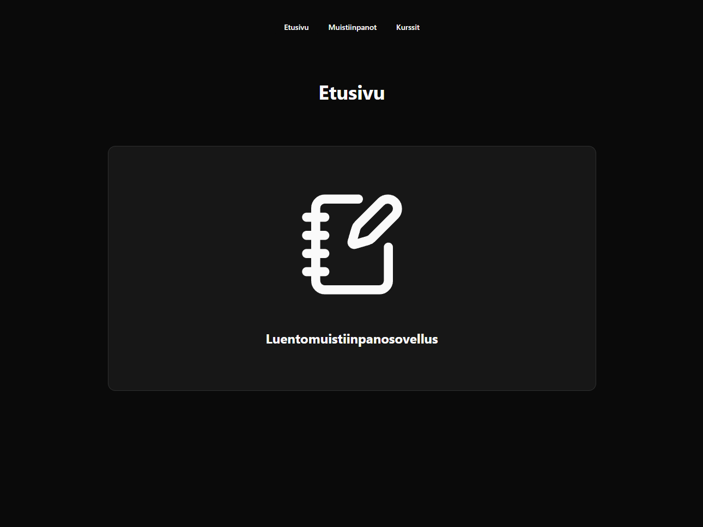
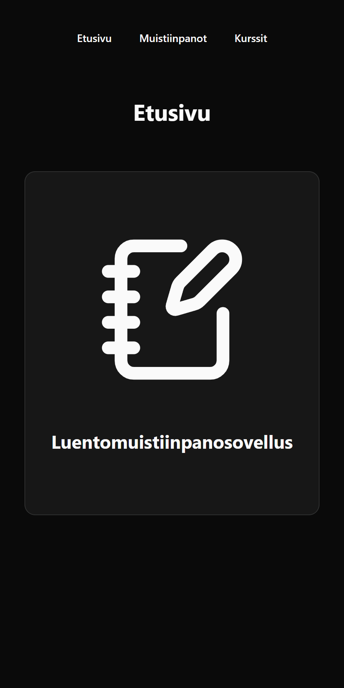
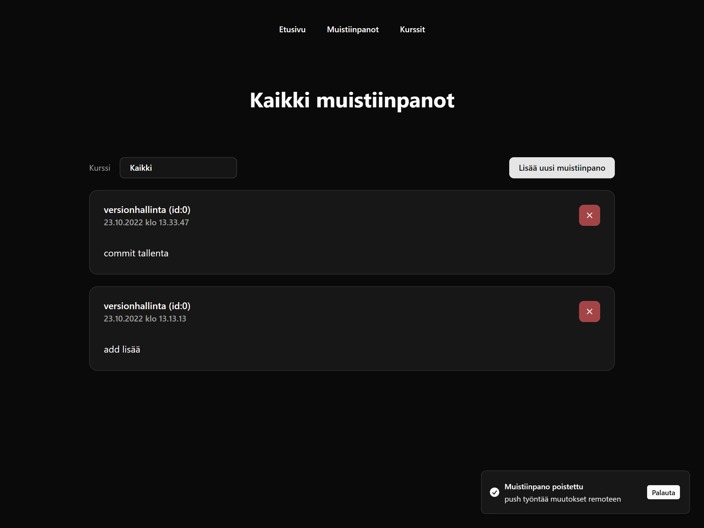
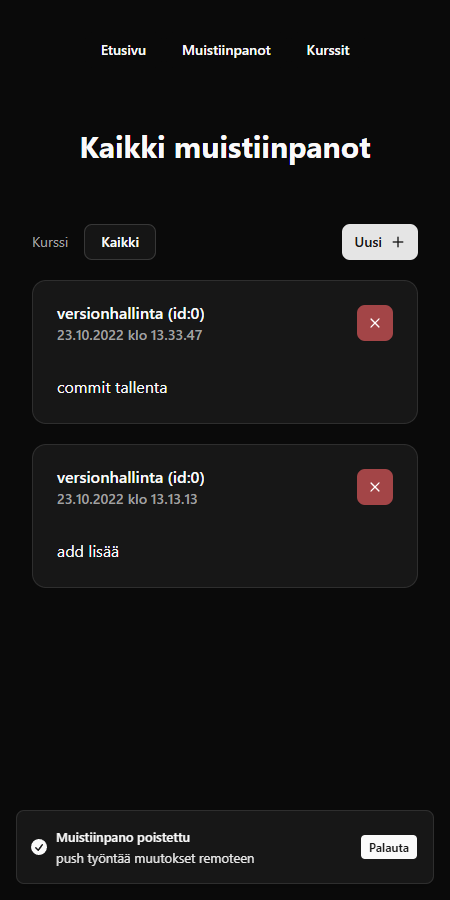
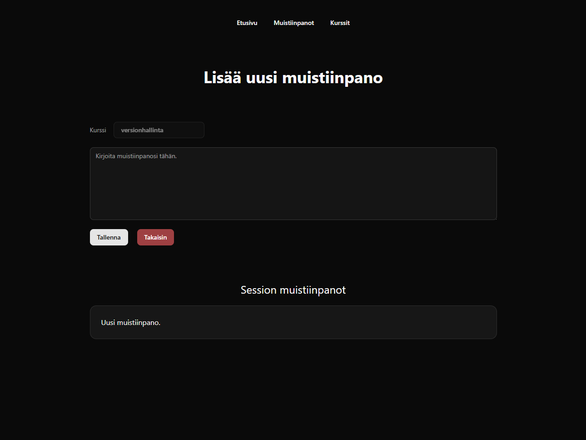
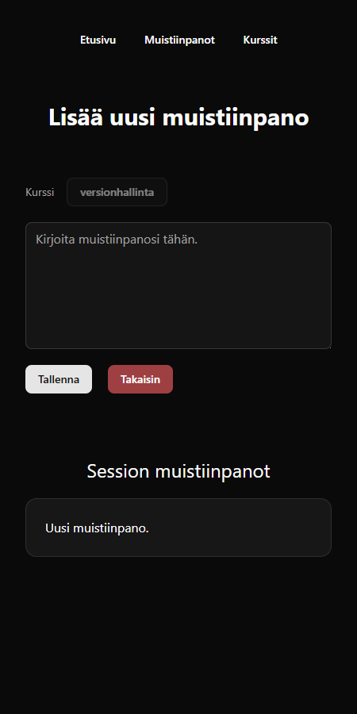
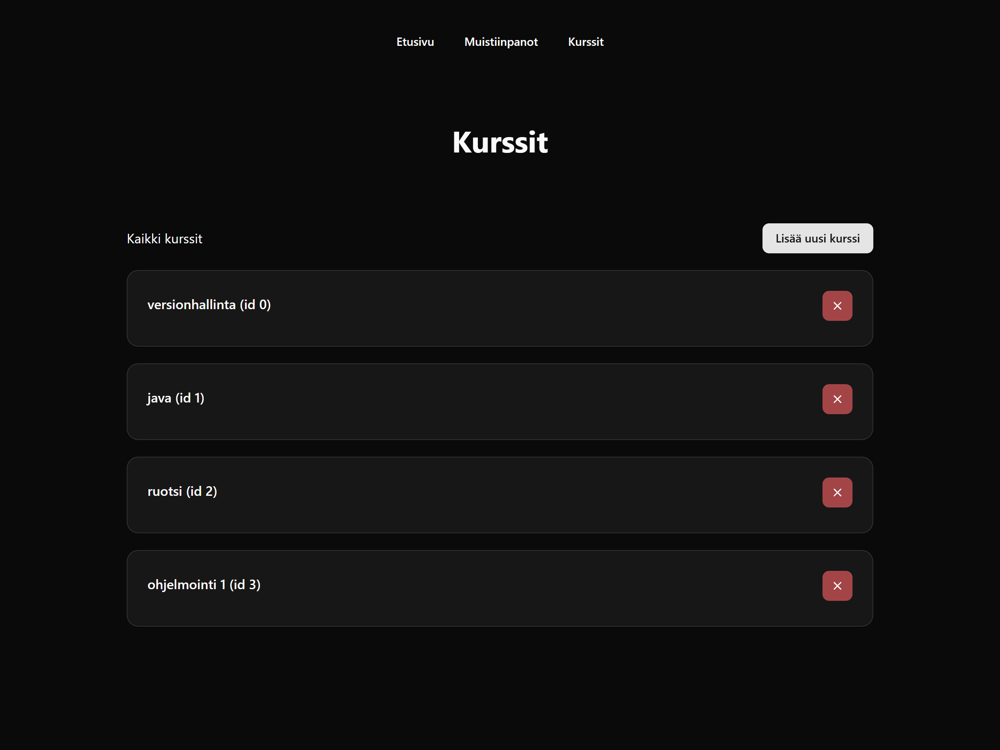
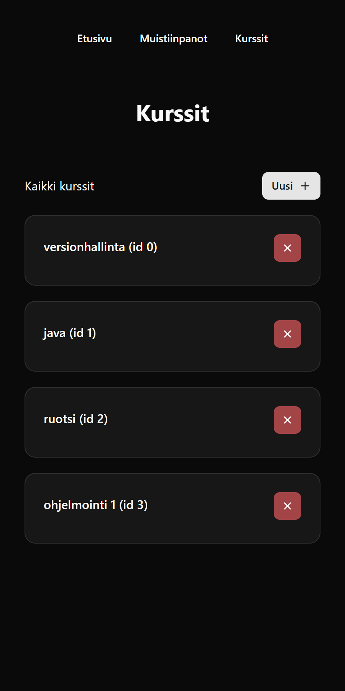
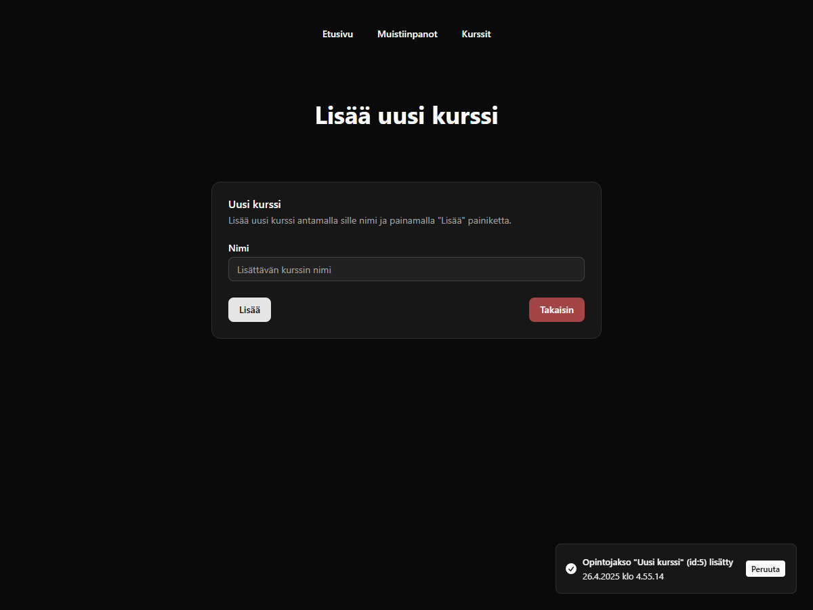
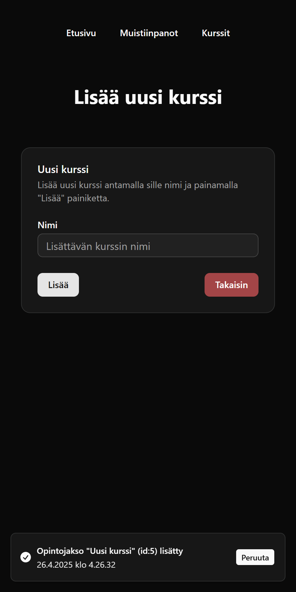

# 📚 Luentomuistiinpanosovellus

Opiskelijoille suunnattu moderni ja selkeä web-sovellus luentomuistiinpanojen ja opintojaksojen tehokkaaseen hallintaan.

🔗 [Demo](https://luentomuistiinpanosovellus.netlify.app/)

---

## 🔍 Sovelluksen ominaisuudet

### 📖 Etusivu

- Yksinkertainen tervetulonäkymä, josta on helppo navigoida eri toimintoihin.

<br>

<p align="left">
  <table>
    <tr>
      <th style="text-align:center;">Työpöytä</th>
      <th style="text-align:center;">Mobiili</th>
    </tr>
    <tr>
      <th style="text-align:center;">
        <p align="center">
                
        </p>
      </th>
      <th style="text-align:center;">
        <p align="center">
                
        </p>
      </th>
    </tr>
    <tr>
      <th colspan="2" style="text-align:center;">
        <em>Klikkaa kuvaa nähdäksesi sen suurempana</em>
      </th>
    </tr>
  </table>
</p>

---

## 📝 Muistiinpanot

- Tarkastele kaikkia tai yksittäisen opintojakson muistiinpanoja.

- Lisää muistiinpanoja valitulle kurssille.

- Poista muistiinpanoja (varmistusviestillä ja peruutusmahdollisuudella).

- Selkeät ilmoitukset, jos muistiinpanoja tai opintojaksoja ei löydy.

<br>

<p align="left">
  <table>
    <tr>
      <th style="text-align:center;">Työpöytä</th>
      <th style="text-align:center;">Mobiili</th>
    </tr>
    <tr>
      <th style="text-align:center;">
        <p align="center">
          
        </p>
      </th>
      <th style="text-align:center;">
        <p align="center">
          
        </p>
      </th>
    </tr>
    <tr>
      <th colspan="2" style="text-align:center;">
        <em>Klikkaa kuvaa nähdäksesi sen suurempana</em>
      </th>
    </tr>
  </table>
</p>

<br>

<p align="left">
  <table>
    <tr>
      <th style="text-align:center;">Työpöytä</th>
      <th style="text-align:center;">Mobiili</th>
    </tr>
    <tr>
      <th style="text-align:center;">
        <p align="center">
          
        </p>
      </th>
      <th style="text-align:center;">
        <p align="center">
          
        </p>
      </th>
    </tr>
    <tr>
      <th colspan="2" style="text-align:center;">
        <em>Klikkaa kuvaa nähdäksesi sen suurempana</em>
      </th>
    </tr>
  </table>
</p>

---

## 🎓 Kurssit

- Kurssien listaus ja helppo lisäysmahdollisuus.

- Kurssien poisto (huom! poistaa myös liitetyt muistiinpanot).

- Informatiiviset ilmoitukset ja peruutusmahdollisuus lisäyksen yhteydessä.

<br>

<p align="left">
  <table>
    <tr>
      <th style="text-align:center;">Työpöytä</th>
      <th style="text-align:center;">Mobiili</th>
    </tr>
    <tr>
      <th style="text-align:center;">
        <p align="center">
          
        </p>
      </th>
      <th style="text-align:center;">
        <p align="center">
          
        </p>
      </th>
    </tr>
        <tr>
      <th colspan="2" style="text-align:center;">
        <em>Klikkaa kuvaa nähdäksesi sen suurempana</em>
      </th>
    </tr>
  </table>
</p>

<br>

<p align="left">
  <table>
    <tr>
      <th style="text-align:center;">Työpöytä</th>
      <th style="text-align:center;">Mobiili</th>
    </tr>
    <tr>
      <th style="text-align:center;">
        <p align="center">
          
        </p>
      </th>
      <th style="text-align:center;">
        <p align="center">
          
        </p>
      </th>
    </tr>
    <tr>
      <th colspan="2" style="text-align:center;">
        <em>Klikkaa kuvaa nähdäksesi sen suurempana</em>
      </th>
    </tr>
  </table>
</p>

---

## 🛠️ Käytetyt teknologiat

- Vite
- SWR
- React
- Shadcn UI
- TypeScript
- Tailwind CSS
- React Router
- Zustand (tilanhallinta)
- Axios (REST API -kutsut)

---

## 🚀 Projektin käyttöönotto

Asenna riippuvuudet ja käynnistä sovellus paikallisesti:

```
npm install
npm run dev
```

---

## 🌐 REST API -integraatio

Sovellus hakee datan seuraavista REST API -osoitteista:

- Kurssit: [Courses](https://luentomuistiinpano-api.netlify.app/.netlify/functions/courses)
- Muistiinpanot: [Notes](https://luentomuistiinpano-api.netlify.app/.netlify/functions/notes)

---

## 🤖 Tekoälyn käyttö

Projektissa hyödynsin ChatGPT (o4-mini-high) -mallia kehityksen apuna erityisesti seuraavissa:

- Tyylittelyn apuna.
- Tässä dokumentaatiossa.
- Netlifyn funktioiden konfugroinnissa.
- TypeScript (ja JavaScript) syntaksin opettelussa.
- Kansiorakenteen suunnittelussa ja koodin refaktoroinnissa.
- Ongelmanratkaisussa ja teknisten konseptien selittämisessä.
- React Routerin nested routing -toimintojen selkeyttämisessä.

Tekoäly ei toiminut suorana lähteenä koodille, vaan oppimisen tukena, varmistaen dokumentaation avulla aina ratkaisujen oikeellisuuden. Jos jotakin on käytetty tekoälyltä suoraan, niin siitä on maininta commiteissa.

---

## 💡 Omakohtainen kokemus

Tämä projekti opetti minulle valtavasti uutta Reactista ja TypeScriptistä. Vaikka alkuun olikin haasteita syntaksin kanssa, projekti auttoi minua ymmärtämään modernien web-sovellusten rakennetta ja toimintaa syvällisemmin. Erityisesti Shadcn UI ja TypeScript osoittautuivat projektin edetessä aikaa säästäviksi valinnoiksi. Olen erittäin tyytyväinen projektin lopputulokseen ja omaan kehitykseeni ohjelmoijana.

---

## ⚠️ Tiedossa olevat ongelmat

- Desktop-näkymässä dropdown-valikon ajoittainen välähtäminen (uudelleenrenderöinti) kurssia valittaessa. PS. Tähän otan ilomielin ratkaisun vastaan.
- Mobiilinäkymässä ARIA-virheilmoitus dropdown-valikkoa painaessa (Blocked aria-hidden) joka ei ehkä ole varsinainen virhe ja tapahtuu VAIN selainikkunan kokoa muuttaessa, mitä ei mobiilissa tapahdu.

---

## 📋 Todo List

- [ ] Viimeistele README.md
- [ ] Siisti commitit
- [ ] Korjaa dropdownin uudelleenrenderöinti
- [ ] Selvitä onko ARIA-virheilmoitus oikea bugi
